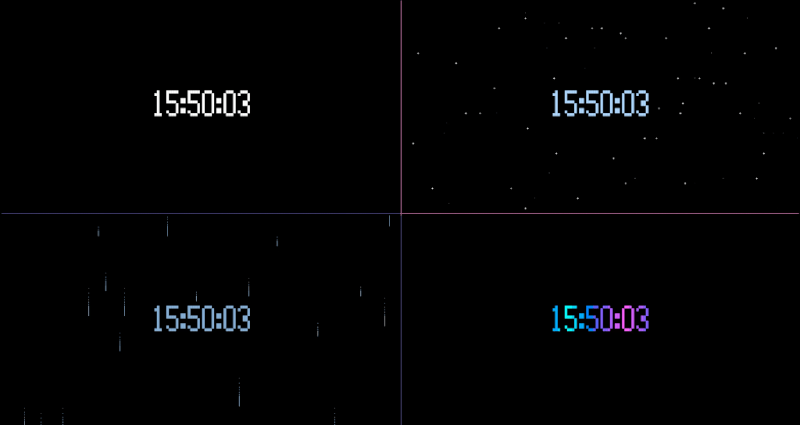

# tui-time

Small terminal apps to jazz up idle panes. Each app is a single Python
file with no dependencies beyond the standard library.



## Apps

| App | Class | What it does |
|-----|-------|--------------|
| [clock](apps/ambient/clock/README.md) | ambient | Big-digit wall clock that fills the pane, with optional themes: `plain`, `night`, `rain`, `wave` |
| [weather](apps/ambient/weather/README.md) | ambient | Current conditions for one place from Open-Meteo: big-digit temperature, condition, location and how old the reading is, with a defined pane for every failure |

```
python3 apps/ambient/clock/clock.py --theme night
python3 apps/ambient/weather/weather.py Lisbon
```

Ambient apps fill a pane and are looked at, not driven. Interactive
apps take keyboard input; none are built yet. [ROADMAP.md](ROADMAP.md)
lists what's next.

## Requirements

- A Unix-like system (Linux or macOS). The apps rely on POSIX signals
  and terminal handling. Developed and tested on Linux.
- Python 3, standard library only. Tested on Python 3.13.
- A terminal with 256-color support. With `NO_COLOR` set, the apps
  draw without color.
- A UTF-8 terminal and a font with block characters for the best
  rendering. Otherwise the apps fall back to ASCII.
- Network access to Open-Meteo for weather. No API key is needed.
- tmux is optional. Each app fills whatever terminal or pane it runs in
  and redraws on resize.

## Why this repo exists

tui-time is a project for learning agentic development with
[Claude Code](https://claude.com/claude-code). The apps are small on
purpose. Each one is enough work to exercise the whole loop, from idea
to merged PR, without the app itself taking over.

Matt Pocock's [skills](https://github.com/mattpocock/skills) guide the
workflow. A typical app goes through these steps:

1. **Grill** the idea until its scope and edge cases are settled
   (`grilling`).
2. **Spec** it as a GitHub issue, then split the spec into tickets
   (`to-spec`, `to-tickets`).
3. **Implement** the tickets on one branch per app, named
   `<class>-<app>`, with one commit per ticket (`implement`, `tdd`).
4. **Review** the branch on two axes, repo standards and spec
   (`code-review`), then fix what the review turns up.
5. **Merge** through a single PR that closes the spec and its tickets.

The agent writes code, commits, and manages issues and PRs. A human
pushes. [CLAUDE.md](CLAUDE.md) and the per-class `CLAUDE.md` files hold
the conventions and app contracts the agent works under, and
[docs/](docs/README.md) holds the reference material behind them.
[docs/lessons/](docs/lessons/) records what went wrong along the way
and what changed because of it.
